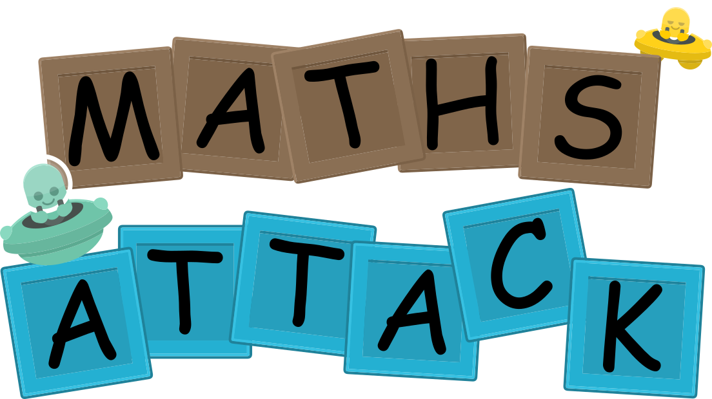

# MathsAttack

Android App/Game for improving fast mental calculation while having fun.

I might add more stuff in the future. 

Open an issue if you want something to be added or have some feedback :)

## How to use
Download the project and open it on Android Studio. Easy!

Developed on Android Studio Dolphin 2021.3.1 using target api 31.

You can build and APK to play on your phone (touch controls are much better than mouse)!

## Thanks to:
- Grafika test app on Github (Very useful if you want to render real-time graphics on Android Apps): https://github.com/google/grafika
- Kenney for Game Asset Pack 1 (Most images are from that asset pack): https://www.kenney.nl